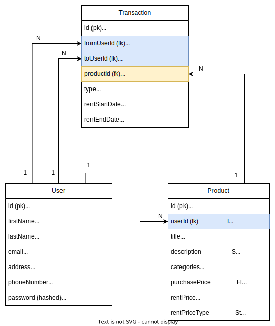

## Development Flow:


## Data Model:



- `User` table for users data
- `Product` table for products data
- `Transaction` table for RENT/BUY:
  - `type` is either **RENT** or **BUY**
  - `fromUserId` represents the user who sold/lent a product (owner)
  - `toUserId` represents the user who bought/rented a product
  - `productId` represents the product being sold/lent
  - `rentStartDate` and `rentEndDate` are only for **RENT**

## Folder Structure:

### Back End (/server):

```bash
├── prisma
│   ├── migrations
│   └── schema.prisma
└── src
    ├── gql
    │   ├── resolvers
    │   │   ├── auth.resolver.js
    │   │   ├── index.js
    │   │   ├── product.resolver.js
    │   │   ├── transaction.resolver.js
    │   │   └── user.resolver.js
    │   └── schema.js
    ├── index.js
    └── middlewares
        └── auth.middleware.js
```

- `prisma/schema.prisma` is the db schema
- `src/index.js` is the main entry point
- `src/gql/resolvers` contains business logic (controllers for REST, resolvers for GraphQL)
- `src/gql/schema.js` contains GraphQL schema

### Front End (/client):

```bash
├── src
│   ├── components
│   ├── gql
│   │   ├── mutations
│   │   └── queries
│   ├── pages
│   └── utils
```

- `src/components` has smaller reusable components
- `src/pages` has the pages where routing is applied
- `src/gql/queries` has the GraphQL queries to fetch data
- `src/gql/mutations` has the GraphQL mutation for modifying data (create/update/delete)
- `src/utils` has the utility/helper functions

## Areas to improve:

- Didn't use **Apollo cache**
  - Forgot to use apollo caching :/
  - Need to re-think where and when caching can be implemented
  - Need to reduce refetch
- Navigation can be improved
  - Front end routes need to be more structured
  - Navigating with browsers back-forward buttons feels inconsistent (specially in bought-sold-borrowed-lent page)
  - A global navigation system is needed
